# gerenciamento_de_loja
 App to manage the purcheses made on <a href="https://github.com/CooperLove/loja_virtual">Loja Virtual</a>
 
 Utilizes the BLoC pattern and firebase as backend.
 
## Functionalities
 * See the list of clients and the amount they have spent
 * Search for a particular client
 * Regress/Advance the status of an order
 * Add/Remove products to the list of products on <a href="https://github.com/CooperLove/loja_virtual">Loja Virtual</a>
 * Change the products (Description, price and photos)
 * Crop added photos (From gallery or camera)
 * Show the orders list based on their status 
 
## Screens:
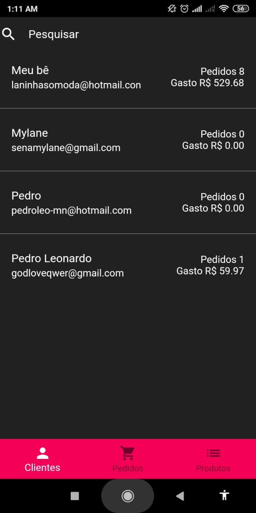

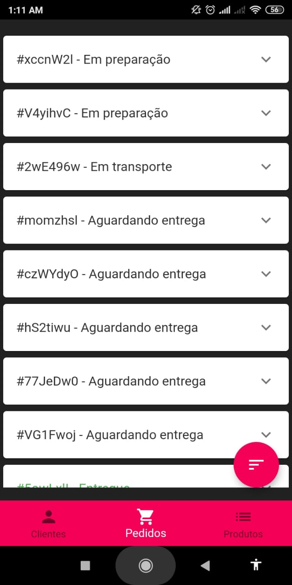
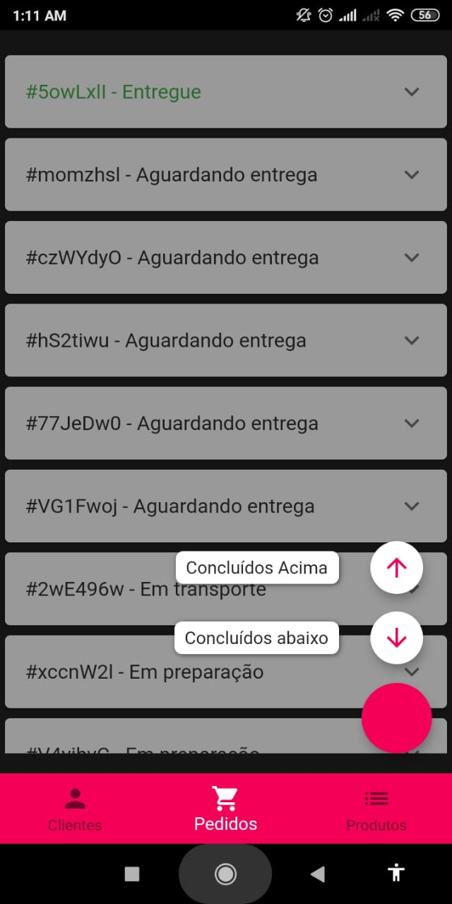
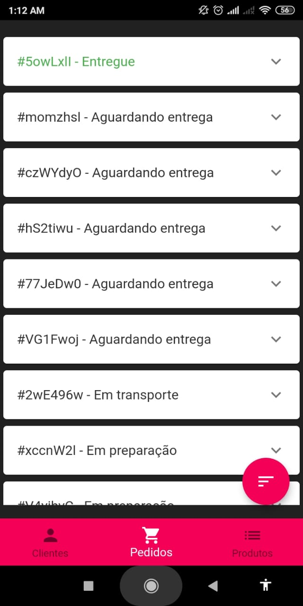
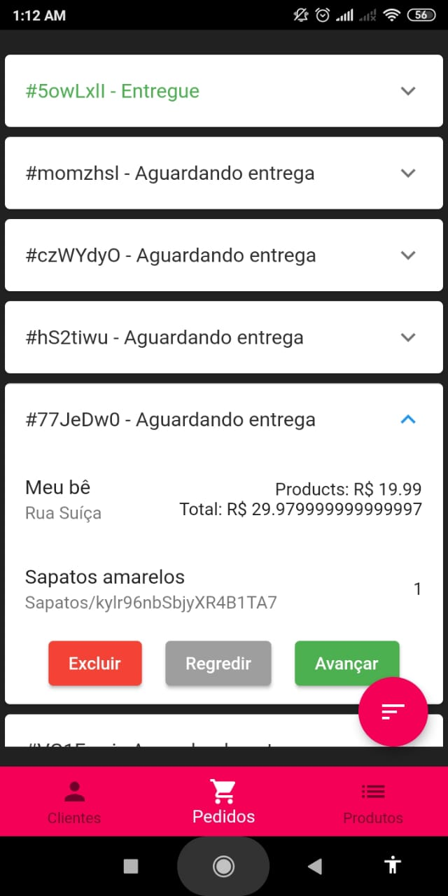
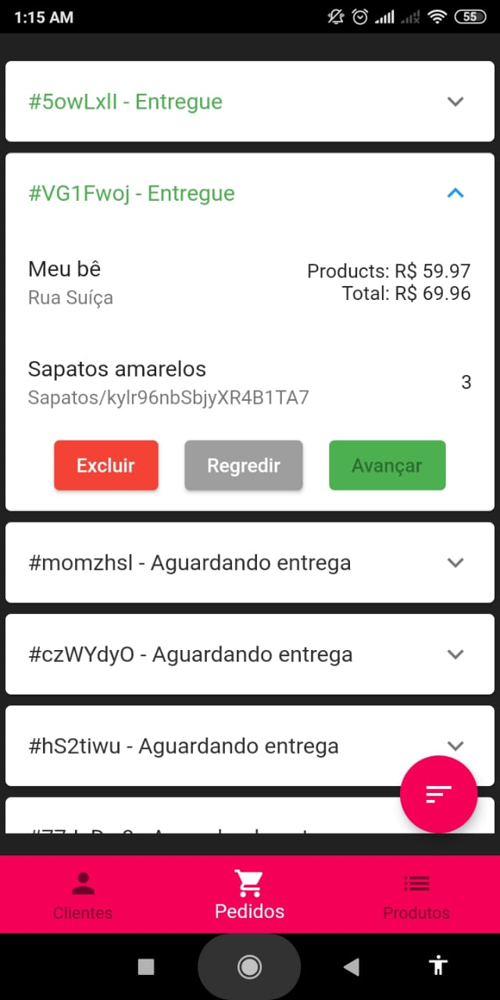
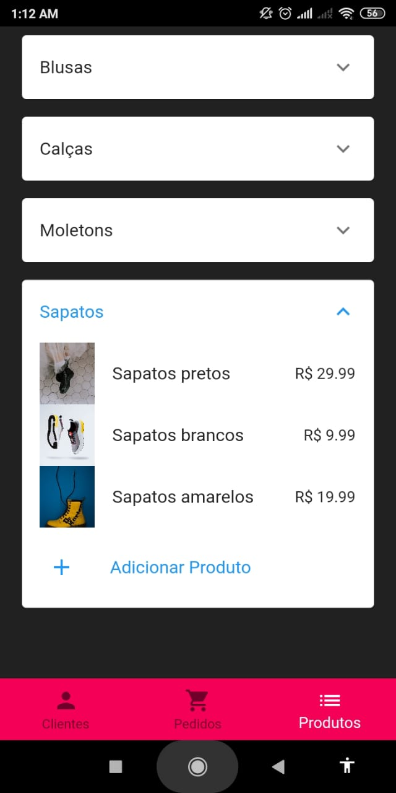
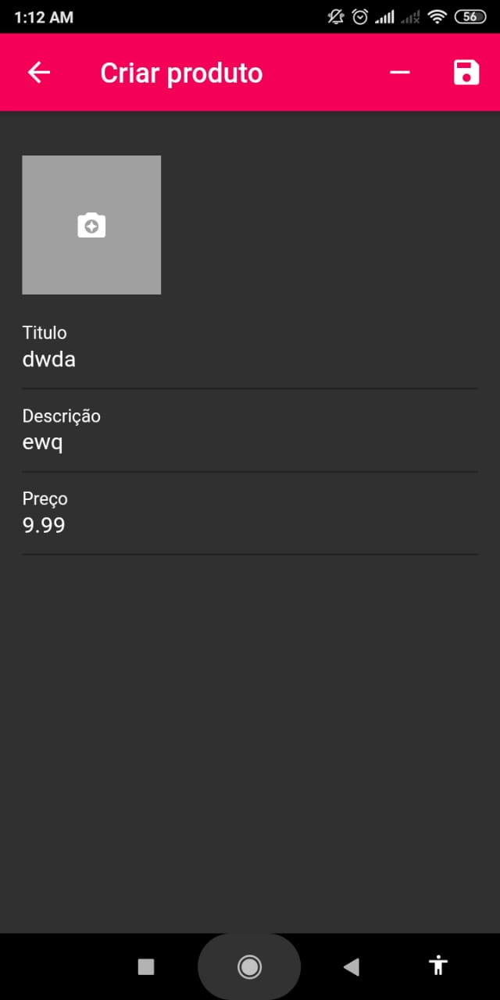
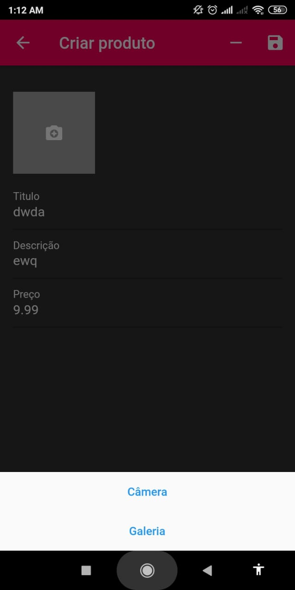
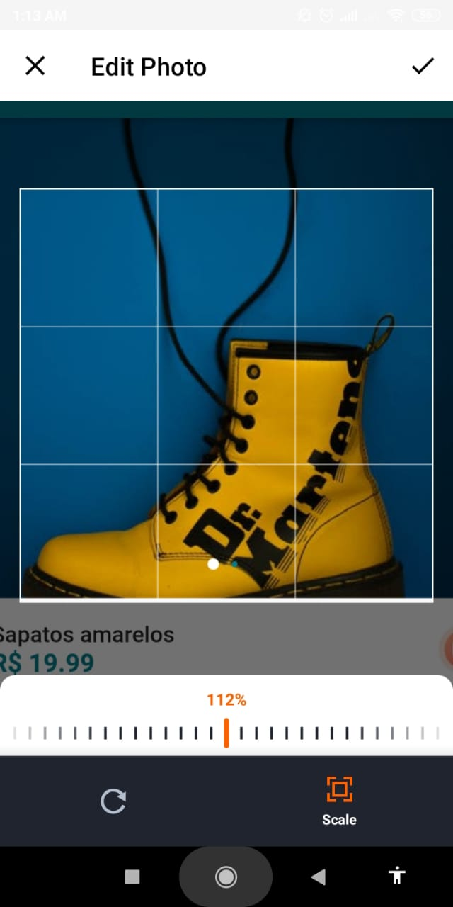

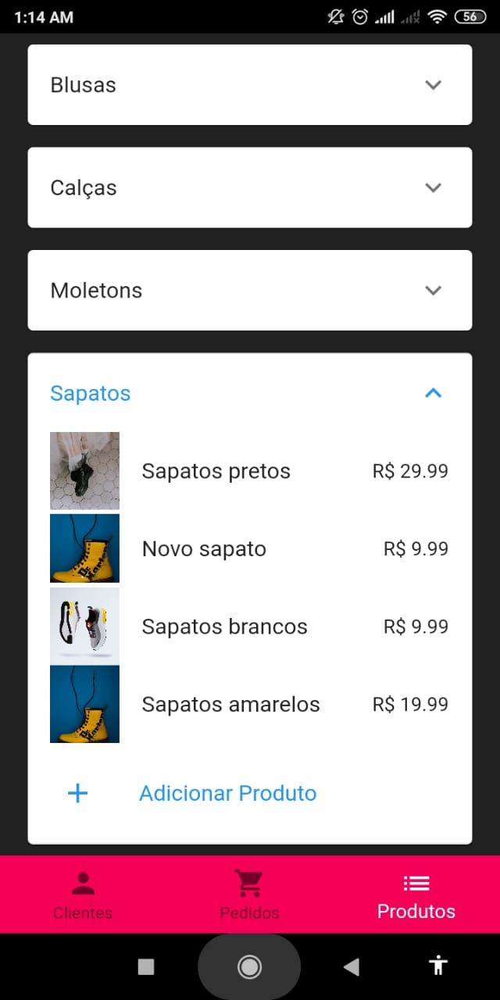
